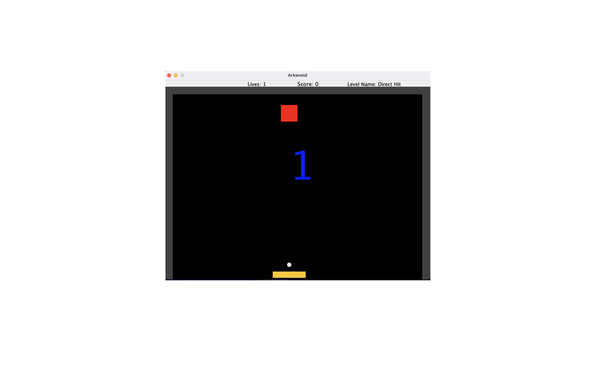
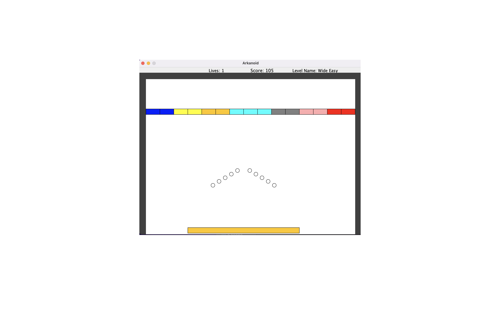
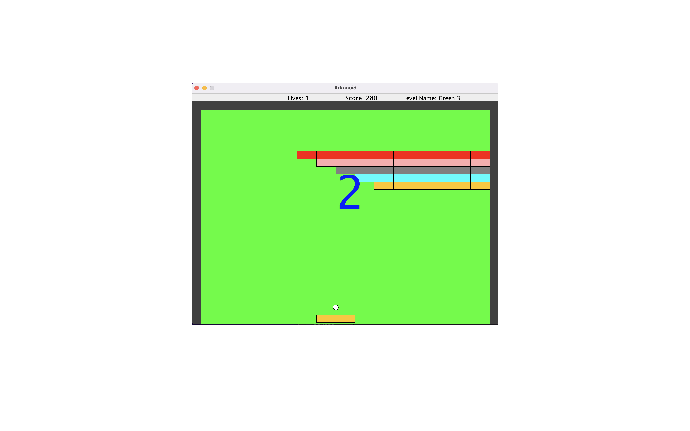

# OOPCourse_Arkonid
This is a minimal version of the classic arkonid game written in Java using OOP principles.

This project took place in an OOP course on my first year of my first CS-degree.

The code is the logic of the game, the GUI package supplied by our course staff. 

## Description
This game includes 4 levels and the player have 1 live.

Before each level there is a counter which is count down from 3.

**The rules** are like the classic arkonid game- 

The ball bounce on the paddle and hits blocks, in every hit the block removed.

You win a level if you removed all the blockes.

For eack block the player manage to remove he gets 5 points and for the first block in level 1 is 105 points.

The game have a WINNER screen, a LOSER screen and a PAUSE screen.

### Implemented Design Patterns
- 

## Getting Started

### Dependencies
- Apache Ant 

### Installing & Executing program
Open the repo in your java idea, I recommend on IntelliJ.

The project contains build.xml which build the project with ant, so you need to install ant and in the idea to run the ant script.

Afterwards, you can simply run.

## ScreenShots

- Stage 1

 
 
 - Stage 2

 
 
 - Stage 3

 

## Authors

Contributors names:

- Rotem Ghidale 
